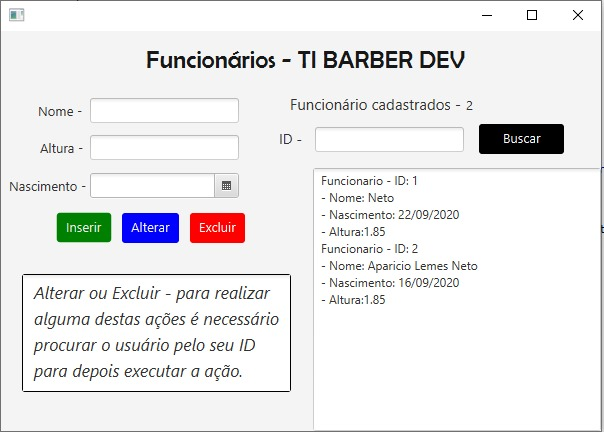

# Cadastro-Funcionarios

## Componentes utizados - JavaFX
- DataPicker
- Label
- AnchorPane
- TextField
- Button

## Funcionalides 

- Criar novo funcionário
- Deletar funcionário pelo ID
- Editar Funcionário pelo ID
- Excluir funcionário pelo ID

## Banco de Dados utilizado

- HSQLDB
